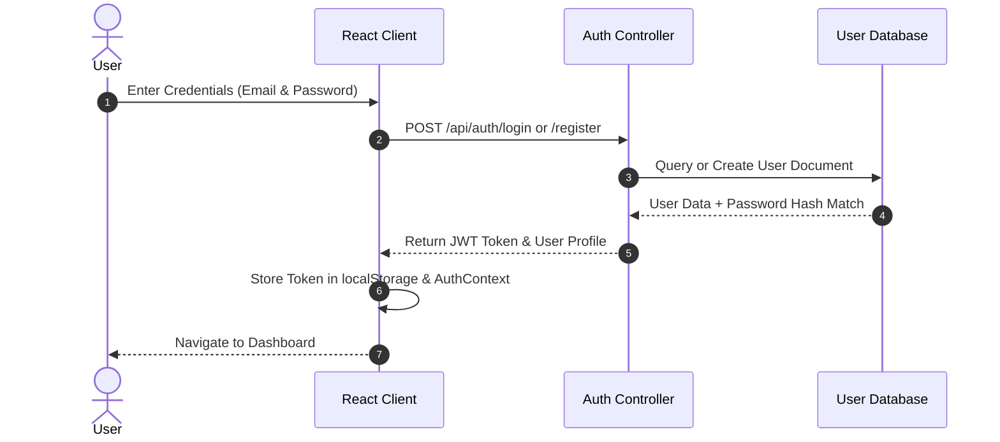
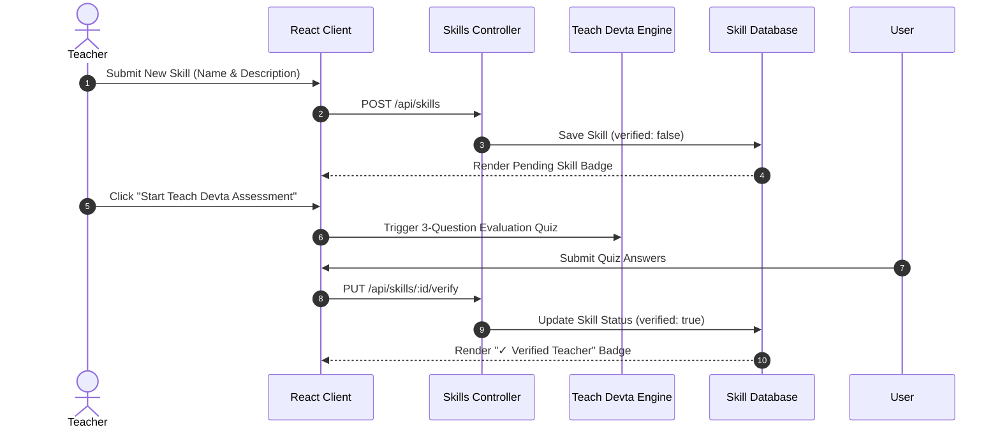
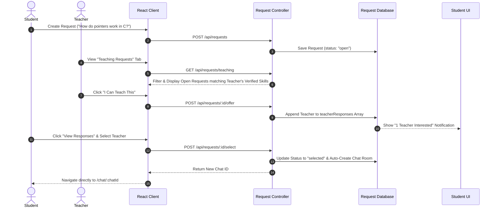

# 🏗️ Teach, Learn & Earn (TL&E) — Architecture, Requirements & Workflow Specification

This document provides a comprehensive technical blueprint of the **Teach, Learn & Earn (TL&E)** platform, focusing on system goals, architecture topology, system requirements, and detailed end-to-end user workflows.

---

## 🎯 1. Project Vision & Core Goals

### Primary Goals
1. **Dual-Role Account Model**: Enable every registered user to act seamlessly as both a **Learner (Student)** and an **Expert (Teacher)** without needing multiple accounts.
2. **AI-Assisted Qualification (Teach Devta Engine)**: Ensure quality control by evaluating and verifying teachers through an automated AI assessment engine before they accept student requests.
3. **Peer-to-Peer Matchmaking**: Provide an intuitive request-and-offer system where students specify exact learning needs, and qualified teachers submit direct teaching offers.
4. **Real-Time Collaboration**: Facilitate direct 1-on-1 learning sessions via dedicated real-time chat rooms with message history and context preservation.
5. **Measurable Skill Growth**: Track learning milestones, active teaching student counts, and total exchange sessions through unified analytics.

---

## 📐 2. System Architecture Blueprint

```
 ┌───────────────────────────────────────────────────────────────────────────┐
 │                            FRONTEND LAYER (Vite)                          │
 │  ┌──────────────┐   ┌──────────────┐   ┌──────────────┐   ┌────────────┐  │
 │  │ React 19 UI  │   │ Router (v7)  │   │ AuthContext  │   │ CSS System │  │
 │  └──────┬───────┘   └──────┬───────┘   └──────┬───────┘   └─────┬──────┘  │
 └─────────┼──────────────────┼──────────────────┼─────────────────┼─────────┘
           │                  │                  │                 │
           └──────────────────┴────────┬─────────┴─────────────────┘
                                       │ REST API (JSON / Axios)
                                       ▼
 ┌───────────────────────────────────────────────────────────────────────────┐
 │                            BACKEND LAYER (Express)                        │
 │  ┌──────────────┐   ┌──────────────┐   ┌──────────────┐   ┌────────────┐  │
 │  │ JWT Auth     │   │ Skills API   │   │ Requests API │   │ Chat API   │  │
 │  └──────┬───────┘   └──────┬───────┘   └──────┬───────┘   └─────┬──────┘  │
 └─────────┼──────────────────┼──────────────────┼─────────────────┼─────────┘
           │                  │                  │                 │
           └──────────────────┴────────┬─────────┴─────────────────┘
                                       │ Mongoose ODM
                                       ▼
 ┌───────────────────────────────────────────────────────────────────────────┐
 │                            DATA LAYER (MongoDB)                           │
 │  ┌──────────────┐   ┌──────────────┐   ┌──────────────┐   ┌────────────┐  │
 │  │ User Schema  │   │ Skill Schema │   │Request Schema│   │Chat Schema │  │
 │  └──────────────┘   └──────────────┘   └──────────────┘   └────────────┘  │
 └───────────────────────────────────────────────────────────────────────────┘
```

### Component Breakdown
1. **Client Layer (React 19)**: Single-Page Application (SPA) with client-side routing, responsive layout components, and dark/light theme switching.
2. **API Layer (Express.js)**: Modular RESTful controller endpoints protected by JWT authentication middleware.
3. **Database Layer (MongoDB + Mongoose)**: Document-oriented database handling relational schema links (`User`, `Skill`, `LearningRequest`, `Chat`).
4. **AI Subsystem (Teach Devta)**: Dual-purpose assessment & assistant module for skill verification and immediate learning support.

---

## 📋 3. System Requirements

### Functional Requirements
- **Authentication**: User registration, login, JWT token issue & storage, profile retrieval (`/api/auth/me`).
- **Skill Inventory**: Add teaching skills, trigger Teach Devta verification, delete skills, fetch personal and global skill directories.
- **Request Lifecycle**: Create learning request, list open requests matching teacher skills, submit teaching offer, select chosen teacher.
- **Messaging**: Open dedicated chat room upon teacher selection, send/receive text messages, fetch conversation history.
- **Analytics**: Aggregate skills taught, skills currently learning, student enrollment metrics, and total message interactions.

### Non-Functional Requirements
- **Security**: Password hashing via `bcryptjs`, JWT token verification middleware, CORS origin filtering.
- **Resilience**: Triple-tier fail-safe database connection (MongoDB Atlas → Local MongoDB → In-Memory Database).
- **Performance**: Instant UI state feedback (< 100ms response) and lightweight bundle footprint.

---

## 🔄 4. Detailed End-to-End Workflows

### Workflow 1: User Onboarding & Authentication


---

### Workflow 2: Teacher Skill Addition & Teach Devta AI Verification


---

### Workflow 3: Student Learning Request & Teacher Matchmaking


---

### Workflow 4: Real-Time Chat & Progress Tracking
```mermaid
sequenceDiagram
    autonumber
    actor Participant as Student / Teacher
    participant UI as React Client
    participant API as Chat & Progress API
    participant DB as Chat Database

    Participant->>UI: Open Chat Room (/chat/:id)
    UI->>API: GET /api/chats/:id
    API->>DB: Fetch Message Stream & Participant Profiles
    DB-->>UI: Render Chat Bubbles & Avatars

    Participant->>UI: Type Message & Hit Send
    UI->>API: POST /api/chats/:id/message
    API->>DB: Append Message (sender, content, timestamp)
    DB-->>UI: Update Chat Stream & Auto-Scroll to Bottom

    Participant->>UI: Navigate to Progress Page
    UI->>API: GET /api/progress
    API-->>UI: Render Calculated Stats (Active Students, Skills Learning, Messages Sent)
```

---

## 🎯 Summary of Key Architectural Goals

1. **Zero-Configuration Setup**: Self-healing database fallback ensuring smooth local execution.
2. **Modular REST API**: Clear separation between Auth, Skills, Requests, Chats, and Progress modules.
3. **Decoupled State Management**: React Context (`AuthContext`) cleanly separating auth lifecycle from page components.
4. **Predictable Data Flows**: Unidirectional data binding ensuring reliable UI updates.
